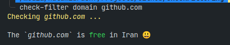
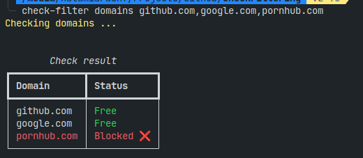
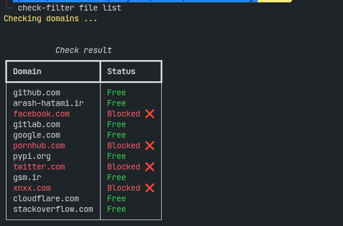

# Check Filtering

[](https://www.python.org/) [](https://GitHub.com/hatamiarash7/CheckFiltering/releases/) [](https://github.com/hatamiarash7/CheckFiltering/actions/workflows/release.yml)  

Check URLs that filtered ( or not ) in Iran

## Requirements

- Python 3.10+

## Install

```bash
pip install check-filter
```

You can also download wheel package from [release](https://github.com/hatamiarash7/CheckFiltering/releases/latest) page.

## Usage

You can use this package in three ways:

1. Single domain

   ```bash
   check-filter domain github.com
   ```

   

2. Multiple domains

   ```bash
   check-filter domains github.com,google.com
   ```

   

3. From a file

   Create a file from your website URLs. Put each URL in a new line.

    ```text
    github.com
    arash-hatami.ir
    facebook.com
    gitlab.com
    google.com
    pornhub.com
    pypi.org
    twitter.com
    gsm.ir
    xnxx.com
    cloudflare.com
    stackoverflow.com
    ```

    Then run the following command:

    ```bash
    check-filter file list
    ```

    

---

## Support 💛

[](https://donatebadges.ir/donate/Bitcoin/bc1qmmh6vt366yzjt3grjxjjqynrrxs3frun8gnxrz) [](https://donatebadges.ir/donate/Ethereum/0x0831bD72Ea8904B38Be9D6185Da2f930d6078094)

[](https://ko-fi.com/D1D1WGU9)

<div><a href="https://payping.ir/@hatamiarash7"></a></div>

## Contributing 🤝

Don't be shy and reach out to us if you want to contribute 😉

1. Fork it!
2. Create your feature branch: `git checkout -b my-new-feature`
3. Commit your changes: `git commit -am 'Add some feature'`
4. Push to the branch: `git push origin my-new-feature`
5. Submit a pull request

## Issues

Each project may have many problems. Contributing to the better development of this project by reporting them. 👍
