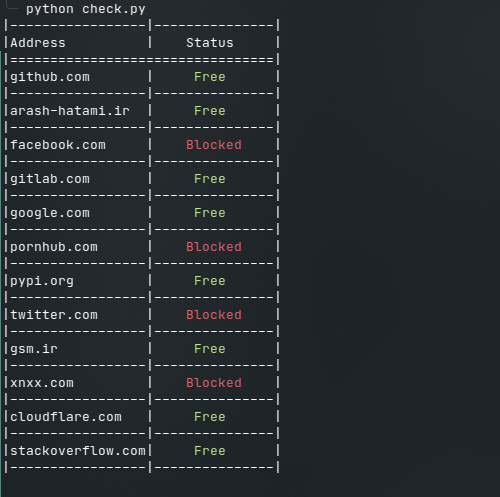

# Check Filtering

[](https://www.python.org/) [](https://GitHub.com/hatamiarash7/CheckFiltering/releases/) [](https://github.com/hatamiarash7/CheckFiltering/actions/workflows/codeql-analysis.yml) [](https://github.com/hatamiarash7/CheckFiltering/actions/workflows/gitguardian.yml) [](https://github.com/hatamiarash7/CheckFiltering/actions/workflows/release.yml)

Check URLs that filtered ( or not ) in Iran

- Install requirements

```bash
python -m pip install -r requirements.txt
```

- Update `list` and add your website URLs

```text
github.com
facebook.com
gitlab.com
google.com
pornhub.com
pypi.org
twitter.com
gsm.ir
xnxx.com
cloudflare.com
stackoverflow.com
```

- Run the checker


